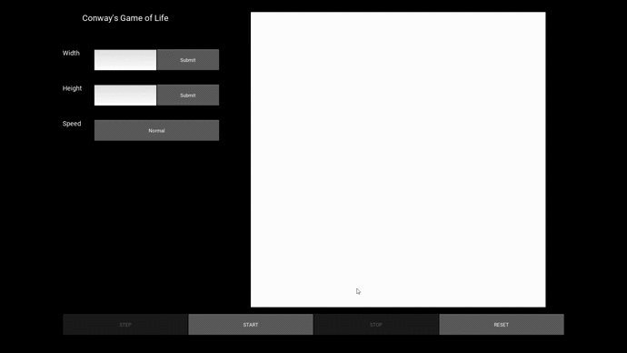

# Conways-Game-of-Life
An app to explore Conway's Game of Life 

# Overview
I wanted to create an app where I could play around with Conway's Game of Life (CGoL) and learn more about cellular automata.

# Learning Objective
Using Kivy the goal was to create a dashboard where I could set the grid size, initial conditions, etc for CGoL. I also
wanted to learn more on how to visualize simulations in general and practice making use of the MVC architecture. 

# Future Additions
- add the ability to change probability of initial cell condition
- add ability to set seed
- add the ability to save current state to pick up where you left off
- determine if slowdown over time is due to a memory leak, graphics rendering, or computations
    -- if memory leak --> fix
    -- if graphics --> optimize
    -- if computations --> add threading
- Long Term 
    -- Make it so you can paint the initial conditions on the grid
